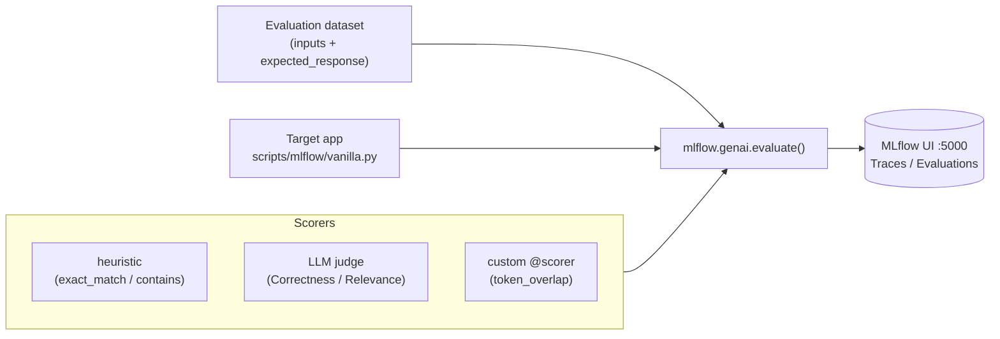

# Step 5 - MLflow GenAI Evaluation

## Goal

In this step you will move from **"capturing traces"** (Step 2) to **"measuring
output quality"** with [MLflow 3.x GenAI Evaluation](https://mlflow.org/docs/latest/genai/).

By the end you will be able to:

- Define an **evaluation dataset** with inputs and expected responses.
- Score outputs with **heuristic scorers** – no Azure / LLM required.
- Score outputs with **LLM-judge scorers** (Correctness, RelevanceToQuery).
- Implement your own **custom `@scorer`** for domain-specific metrics.
- **Compare** evaluation runs side-by-side in the CLI and in the MLflow UI.



!!! tip "Steps 1-3 are available without Azure"
    The `trace`, `dataset`, `evaluate`, and `custom-scorer` subcommands run
    entirely on your laptop – **no Azure credentials required**. Only `judge`
    needs a deployed chat model.

## Why this step exists

Step 2 captures *what happened*. Step 5 answers *was it good?*

Evaluation lets you:

- **Catch regressions** when you change a prompt or swap a model.
- **Compare configurations** (different prompts, temperatures, models) on a
  fixed dataset.
- **Quantify quality** with numbers instead of manual eyeballing.

MLflow GenAI Evaluation keeps everything local: the dataset, the scoring
logic, and the result store all live on your laptop. You can graduate to
remote experiments later without changing the scoring code.

## Prerequisites

- `make mlflow` is running (MLflow server on `http://127.0.0.1:5000`).
- The project dependencies are installed (`uv sync`).
- For the `judge` subcommand only: Azure credentials (`az login`) and a
  deployed chat model (e.g. `azure_ai:gpt-5`).

## Step 5a – Record a trace

Run the built-in QA function once and record an MLflow trace:

```shell
uv run python scripts/mlflow/vanilla.py trace \
    --question "What is the capital of France?"
```

Expected output:

```text
Q: What is the capital of France?
A: Paris
```

Open [http://127.0.0.1:5000](http://127.0.0.1:5000) to see the trace under
the default experiment.

## Step 5b – Inspect the evaluation dataset

Print the five built-in QA pairs:

```shell
uv run python scripts/mlflow/vanilla.py dataset
```

Each row contains:

| Field               | Description                             |
| :------------------ | :-------------------------------------- |
| `inputs.question`   | The question sent to the model          |
| `expected_response` | The gold-standard answer used by scorers |

Save it to a file for inspection or offline editing:

```shell
uv run python scripts/mlflow/vanilla.py dataset --output /tmp/eval_dataset.json
```

## Step 5c – Heuristic evaluation (no Azure required)

Run the QA function against all five dataset rows and score each output:

```shell
uv run python scripts/mlflow/vanilla.py evaluate
```

Three pure-Python scorers are applied:

| Scorer        | What it measures                                          |
| :------------ | :-------------------------------------------------------- |
| `exact_match` | 1.0 when output == expected_response (case-insensitive)   |
| `contains`    | 1.0 when output contains expected_response               |
| `non_empty`   | 1.0 when output is non-empty                             |

The command prints an aggregate metrics summary followed by a per-row table.
The run is also stored in MLflow so you can view it in the UI.

```python title="Heuristic scorer pattern"
from mlflow.genai.scorers import scorer

@scorer
def exact_match(outputs: str, expected_response: str) -> float:
    return 1.0 if outputs.strip().lower() == expected_response.strip().lower() else 0.0
```

## Step 5d – LLM-judge evaluation (requires Azure)

Run the QA function with MLflow's built-in LLM judges:

```shell
uv run python scripts/mlflow/vanilla.py judge --model azure_ai:gpt-5
```

Judges applied:

| Judge             | What it measures                          |
| :---------------- | :---------------------------------------- |
| `Correctness`     | Is the answer factually correct?          |
| `RelevanceToQuery`| Is the answer relevant to the question?   |

!!! warning "Azure credentials required"
    The `judge` subcommand calls the chat model to evaluate each output.
    If Azure credentials are missing or the model is unreachable the command
    prints a clear skip message and exits cleanly with code `0`.

## Step 5e – Custom scorer

Implement and apply your own `token_overlap` scorer:

```shell
uv run python scripts/mlflow/vanilla.py custom-scorer
```

The scorer computes the [Jaccard similarity](https://en.wikipedia.org/wiki/Jaccard_index)
between the token sets of `outputs` and `expected_response`:

```python title="Custom scorer pattern"
from mlflow.genai.scorers import scorer

@scorer
def token_overlap(outputs: str, expected_response: str) -> float:
    """Jaccard similarity between output and expected_response token sets."""
    a = set(outputs.lower().split())
    b = set(expected_response.lower().split())
    if not a and not b:
        return 0.0
    return len(a & b) / len(a | b)
```

Use this pattern to add any domain-specific metric (e.g. BLEU, ROUGE, safety
classifier score) as a first-class MLflow scorer.

## Step 5f – Compare evaluation runs

After running two or more evaluation subcommands, compare them:

```shell
uv run python scripts/mlflow/vanilla.py compare
```

The command fetches recent runs from the configured MLflow experiment,
selects the metric columns, and prints a side-by-side table sorted by most
recent first.

For an interactive comparison with charts and filtering, open the MLflow UI:

```text
http://127.0.0.1:5000
```

Navigate to **Experiments → [experiment name] → Evaluation** to see a
colour-coded comparison across all runs.

## Verify

Run all three local subcommands in sequence and confirm they complete without
errors:

```shell
uv run python scripts/mlflow/vanilla.py trace
uv run python scripts/mlflow/vanilla.py dataset
uv run python scripts/mlflow/vanilla.py evaluate
uv run python scripts/mlflow/vanilla.py custom-scorer
uv run python scripts/mlflow/vanilla.py compare
```

All five commands should print results to stdout and exit with code `0`.
The `evaluate`, `custom-scorer` and `judge` runs also appear in the MLflow
UI under the default experiment.

## Troubleshooting

??? failure "MLflow server is not running"
    Start the server before running any subcommand:

    ```shell
    make mlflow
    ```

    The CLI reads `MLFLOW_TRACKING_URI` from `.env` (default `http://127.0.0.1:5000`).

??? failure "ModuleNotFoundError: mlflow.genai"
    The `mlflow.genai` namespace requires `mlflow>=3.12.0`. Check the installed
    version:

    ```shell
    uv run python -c "import mlflow; print(mlflow.__version__)"
    ```

    Re-sync dependencies if needed:

    ```shell
    uv sync
    ```

??? failure "`judge` exits with a skip message"
    The `judge` subcommand gracefully skips LLM evaluation when credentials are
    missing or the model is unreachable. To enable it:

    1. Sign in with `az login`.
    2. Set `AZURE_AI_PROJECT_ENDPOINT` (and optionally `AZURE_AI_MODEL`) in
       your `.env`.
    3. Confirm the model is deployed in your Foundry project.
    4. Re-run: `uv run python scripts/mlflow/vanilla.py judge --model azure_ai:gpt-5`

??? failure "Evaluation result table is empty"
    `mlflow.genai.evaluate()` requires the `data` argument to be a list of
    dicts with an `inputs` key. The built-in dataset already follows this
    shape. If you supply a custom dataset, verify its schema matches.

## What's next

You now have a repeatable local evaluation loop. Potential next steps:

- **Regression gating in CI**: add an `evaluate` step to a GitHub Actions
  workflow and fail the build when a key metric drops below a threshold.
- **Prompt optimisation**: use `mlflow.genai.optimize_prompt()` to
  automatically search for a better prompt given your dataset and scorers.
- **Remote experiment store**: point `MLFLOW_TRACKING_URI` at a shared
  MLflow server so the team can compare runs from different branches.

Return to the [Tutorial Overview](index.md) or jump to
[Appendix - References](appendix.md) for links to all referenced documents.
