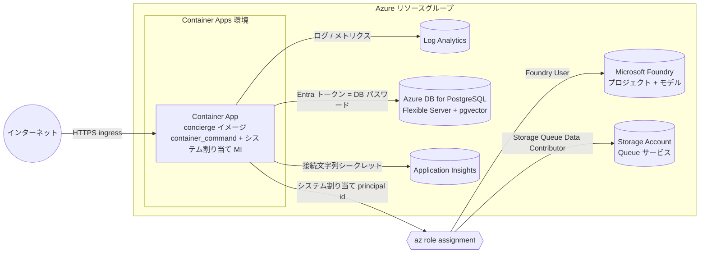

# Terraform で Azure Container Apps へデプロイする

## ゴール

[ks6088ts/template-terraform](https://github.com/ks6088ts/template-terraform)
の
[`azure_container_apps`](https://github.com/ks6088ts/template-terraform/tree/main/infra/scenarios/azure_container_apps)
シナリオを使って concierge の Docker イメージを **Azure Container Apps (ACA)**
上で動かし、各種 Azure 依存リソース (Microsoft Foundry、Azure Database for
PostgreSQL、Azure Storage Queue、Application Insights) へのアクセスを、可能な
限りシークレットではなく **Microsoft Entra ID / マネージド ID** で構成します。

!!! info "このガイドが前提とするテンプレートの機能"
    本ガイドはシナリオの
    [`main`](https://github.com/ks6088ts/template-terraform/tree/main/infra/scenarios/azure_container_apps)
    ブランチに追従しています。シナリオは concierge が
    必要とするものを標準でサポートしており、モジュールをフォークしたり拡張
    したりする必要は **ありません**:

    | 機能 | シナリオ入力 | 補足 |
    | :--- | :--- | :--- |
    | 起動コマンドの上書き | `container_command` (`list(string)`) | 必須。イメージの既定 `CMD` は即終了する |
    | 平文 / シークレット環境変数 | `env_vars` (`list(object)`) | 各要素は `value` か `secret_name` のどちらか一方のみ設定 |
    | Container App シークレット | `secrets` (`list(object)`) | `name` + `value`、`sensitive` 指定 |
    | マネージド ID | 自動で有効 | **システム割り当て** ID が既定で有効。principal id は `container_app_identity_principal_id` として出力される |

    ID が **システム割り当て** であるため、初回の `terraform apply` の *後*
    にしか存在しません。したがって流れは **まずデプロイ → 出力された
    principal id に RBAC ロールを付与** となります。設定すべき
    `AZURE_CLIENT_ID` はありません (これはユーザー割り当て ID のときだけ必要
    です。最後のステップを参照)。

## 仕組み



concierge のすべての Azure SDK 呼び出しは
[`DefaultAzureCredential`](https://learn.microsoft.com/ja-jp/python/api/azure-identity/azure.identity.defaultazurecredential)
で認証します
([`concierge/settings/azure_postgres.py`](https://github.com/ks6088ts-labs/concierge/blob/main/concierge/settings/azure_postgres.py)
と
[`concierge/settings/cloud_agent.py`](https://github.com/ks6088ts-labs/concierge/blob/main/concierge/settings/cloud_agent.py)
を参照)。システム割り当て ID を持つ Container App では、
`DefaultAzureCredential` がその ID を自動的に選択します。このコードベースでは
Storage Queue と PostgreSQL は **接続文字列やアカウントキーを受け付けず**、
Entra 認証のみです。したがってこの 2 つのサービスについてはシークレットに
入れるものはなく、すべて RBAC ロール割り当てに依存します。

## 前提条件

- Azure サブスクリプションと、サインイン済みの
  [Azure CLI](https://learn.microsoft.com/ja-jp/cli/azure/install-azure-cli)
  (`az login`)。
- [Terraform CLI](https://developer.hashicorp.com/terraform/install) `>= 1.6.0`。
- `main` ブランチの
  [ks6088ts/template-terraform](https://github.com/ks6088ts/template-terraform)
  のクローン。
- 公開済みの concierge イメージ。CI が以下にプッシュします:
  - GHCR: `ghcr.io/ks6088ts-labs/concierge:latest`
      ([`ghcr-release.yaml`](https://github.com/ks6088ts-labs/concierge/blob/main/.github/workflows/ghcr-release.yaml))
  - Docker Hub: `ks6088ts/concierge:latest`
      ([`docker-release.yaml`](https://github.com/ks6088ts-labs/concierge/blob/main/.github/workflows/docker-release.yaml))
- 選んだサービスが必要とする Azure 依存リソース (次節)。
  [`azure_microsoft_foundry`](https://github.com/ks6088ts/template-terraform/tree/main/infra/scenarios/azure_microsoft_foundry)
  や
  [`azure_datastore`](https://github.com/ks6088ts/template-terraform/tree/main/infra/scenarios/azure_datastore)
  シナリオで作成しても、既存のものを再利用してもかまいません。

## ステップ 1 - サービスを選び要件を把握する

concierge のイメージは、多数のエントリポイントを持つ 1 つのイメージです。
Container App に渡す `container_command` で何が動くかが決まります。
Container App ごとに 1 つ選びます。

| サービス | `container_command` | `container_port` | ヘルスパス | Azure 依存リソース |
| :--- | :--- | :---: | :--- | :--- |
| `todo-web` | `["todo-web"]` | 8080 | `/healthz` | なし (memory) — 任意で PostgreSQL |
| `chat-web` | `["chat-web"]` | 8080 | `/healthz` | Microsoft Foundry (chat)、任意で PostgreSQL・realtime |
| `cloud-agent-web` | `["cloud-agent-web"]` | 8081 | `/healthz` | Storage Queue + (memory/PostgreSQL) |
| `cloud-agent` ワーカー | `["cloud-agent-cli", "worker"]` | — | — | Storage Queue + Foundry + (memory/PostgreSQL) |

ポートと `/healthz` エンドポイントはコードに由来します。例:
[`concierge/todo/infrastructure/web/app.py`](https://github.com/ks6088ts-labs/concierge/blob/main/concierge/todo/infrastructure/web/app.py)
(`port=8080`)、
[`concierge/cloud_agent/infrastructure/web/app.py`](https://github.com/ks6088ts-labs/concierge/blob/main/concierge/cloud_agent/infrastructure/web/app.py)
(`port=8081`)。`container_port` は、エントリポイントが listen するポートに
合わせます。

!!! warning "イメージの既定コマンドは即終了する"
    イメージの既定 `CMD` は `python -m concierge.core`
    ([`Dockerfile`](https://github.com/ks6088ts-labs/concierge/blob/main/Dockerfile))
    で、1 行ログを出して終了します。これで起動した Container App は再起動
    ループに陥ります。`*-web` コンソールスクリプト
    ([`pyproject.toml`](https://github.com/ks6088ts-labs/concierge/blob/main/pyproject.toml))
    は常駐 Web サーバなので、必ず `container_command` で渡してください。

!!! note "シナリオの ingress とワーカー"
    シナリオは常に `container_port` 上に **外部 HTTPS ingress** を構成します
    (ingress の切り替えは公開していません)。`*-web` サービスにはこれで問題
    ありません。`cloud-agent` **ワーカー** には HTTP ポートがありませんが、
    ワーカーコマンドで別の Container App としてデプロイすれば動作します
    (使われない ingress エンドポイントは付きますが無害です)。

### サービス別の環境変数とロール

| 依存リソース | `env_vars` (平文) | `secrets` | システム割り当て ID への RBAC |
| :--- | :--- | :--- | :--- |
| Foundry (chat / agents) | `AZURE_AI_PROJECT_ENDPOINT` | — | Foundry **アカウント** に `Foundry User` |
| Foundry realtime / image | `AZURE_AI_PROJECT_ENDPOINT_REALTIME`、`AZURE_AI_PROJECT_ENDPOINT_IMAGE` | — | 同じ `Foundry User` のアカウントスコープ割り当てでカバー |
| PostgreSQL (`azure-postgres`) | `AZURE_DBHOST`、`AZURE_DBNAME`、`AZURE_DBUSER`、`AZURE_USE_ENTRA_AUTH=true` | — | ID を Postgres ロールとして登録 |
| Storage Queue (cloud_agent) | `CLOUD_AGENT_QUEUE_BACKEND=azure-storage-queue`、`CLOUD_AGENT_AZURE_STORAGE_ACCOUNT_URL` | — | `Storage Queue Data Contributor` |
| Application Insights | `CONCIERGE_TRACING_ENABLED=true` | `APPLICATIONINSIGHTS_CONNECTION_STRING` | — |

concierge が読むすべての変数は
[`.env.template`](https://github.com/ks6088ts-labs/concierge/blob/main/.env.template)
にあります。

!!! warning "推論には `Azure AI Developer` ではなく `Foundry User` を使う"
    `*.services.ai.azure.com` エンドポイントの Microsoft Foundry プロジェクトは
    `Azure AI Developer` ロールでは認可されません。
    [Foundry RBAC ドキュメント](https://learn.microsoft.com/ja-jp/azure/foundry/concepts/rbac-foundry)
    の通り、このロールは Azure Machine Learning ワークスペース / Foundry ハブ
    向けで、Foundry プロジェクトの推論権限を **付与しません**。このロールで
    モデルを呼ぶと `PermissionDeniedError: Error code: 403` になります。推論を
    付与するロール (`foundry` レスポンダと `azure_ai:` エージェントの両方が使用)
    は **`Foundry User`** (旧名 `Azure AI User`、ロール ID
    `53ca6127-db72-4b80-b1b0-d745d6d5456d`) です。すべてのプロジェクトと
    realtime / image エンドポイントをカバーするため、**Foundry アカウント**
    スコープで割り当てます。
にあります。

!!! tip "まずは `todo-web` から"
    in-memory バックエンドの `todo-web` は、Container App 本体以外に Azure
    依存リソースを **一切** 必要としません。ID やデータサービスを足す前に、
    イメージ・ingress・コマンド上書きを検証する最速の方法です。

## ステップ 2 - `terraform.tfvars` を書く

シナリオは起動コマンドを `container_command`、平文変数を `env_vars`、
シークレット値を `secret_name` で参照される `secrets` から取り込みます。
Foundry と in-memory バックエンドを使う `chat-web` の例 (最も単純な「実用」
サービス):

```hcl
# terraform.tfvars
name            = "concierge-chat"
location        = "japaneast"
container_image = "ghcr.io/ks6088ts-labs/concierge:latest"
container_port  = 8080
cpu             = 0.5
memory          = "1Gi"
min_replicas    = 1
max_replicas    = 3

# 起動コマンド。これがないとイメージは即終了する。
container_command = ["chat-web"]

# 平文の環境変数。
env_vars = [
  { name = "PROJECT_NAME", value = "concierge" },
  { name = "AZURE_AI_PROJECT_ENDPOINT", value = "https://<resource>.services.ai.azure.com/api/projects/<project>" },
  { name = "CHAT_BOT_AGENT_TYPE", value = "foundry" },
  { name = "CONCIERGE_TRACING_ENABLED", value = "true" },
  # シークレット参照: 下の `secrets` の要素を参照する。
  { name = "APPLICATIONINSIGHTS_CONNECTION_STRING", secret_name = "appinsights-connection-string" },
]

# Container App シークレットとして保存される値。
secrets = [
  { name = "appinsights-connection-string", value = "InstrumentationKey=...;IngestionEndpoint=https://<region>.in.applicationinsights.azure.com/" },
]

tags = {
  environment = "dev"
  owner       = "team-ai"
}
```

各 `env_vars` 要素は `value` (平文) か `secret_name` (`secrets` の要素への
参照) の **どちらか一方だけ** を設定する必要があります (モジュールが
バリデーションで強制します)。機密値 (キー・接続文字列) は `secrets` を使い、
平文の環境変数ではなく Container App シークレットとして保存することを推奨
します。

!!! note "ポートの選び方"
    `*-web` コンソールスクリプトは固定ポート (`todo`/`chat` は 8080、
    `cloud-agent` は 8081) で listen するので、`container_port` をその値に
    合わせます。別のポートを使いたい場合は、uvicorn を直接指定してコマンドを
    上書きします。例:
    `container_command = ["uvicorn", "concierge.chat.infrastructure.web.app:create_app", "--factory", "--host", "0.0.0.0", "--port", "80"]`
    として `container_port = 80` を設定。

`cloud-agent-web` の場合は、コマンド・ポート・キュー設定を差し替えます:

```hcl
container_command = ["cloud-agent-web"]
container_port    = 8081

env_vars = [
  { name = "CLOUD_AGENT_QUEUE_BACKEND", value = "azure-storage-queue" },
  { name = "CLOUD_AGENT_AZURE_STORAGE_ACCOUNT_URL", value = "https://<account>.queue.core.windows.net" },
]
```

!!! danger "シークレットをコミットしない"
    実際の値をソース管理に含めないでください。`secrets` は git 管理外の
    `*.auto.tfvars` に置く、`-var-file` で渡す、またはシークレットストア /
    CI から注入します。`main.tf` やコミットされる tfvars にキーをハード
    コードしないでください。

## ステップ 3 - デプロイ (フェーズ 1)

```shell
cd infra/scenarios/azure_container_apps

# azurerm v4 はサブスクリプション ID の明示が必要
export ARM_SUBSCRIPTION_ID=$(az account show --query id -o tsv)

terraform init
terraform plan -out tfplan
terraform apply tfplan

# 公開 URL と、ロールを付与する対象の principal id
terraform output -raw container_app_url
terraform output -raw container_app_identity_principal_id
```

この時点で Container App は **システム割り当てマネージド ID** 付きで稼働
していますが、ロール割り当てはまだありません。in-memory バックエンドのみで
Foundry も不要なサービス (= `todo-web`) は、これで完全に動作します。

## ステップ 4 - ID に RBAC ロールを付与する

出力された principal id を使い、サービスが必要とするロールだけを割り当てます。

```shell
PRINCIPAL_ID=$(terraform output -raw container_app_identity_principal_id)

# Foundry 推論 (chat / agents / realtime / image)。
# Foundry アカウントのリソース ID を名前から解決する (名前は
# AZURE_AI_PROJECT_ENDPOINT ホストの先頭ラベル。例:
# https://<account>.services.ai.azure.com/...)。
FOUNDRY_ID=$(az cognitiveservices account list \
  --query "[?name=='<foundry アカウント名>'].id | [0]" -o tsv)

# ロール名ではなくロール ID を使う: Azure AI User -> Foundry User の名称変更が
# まだ展開中のため。アカウントスコープで割り当てる。
az role assignment create \
  --assignee-object-id "$PRINCIPAL_ID" \
  --assignee-principal-type ServicePrincipal \
  --role "53ca6127-db72-4b80-b1b0-d745d6d5456d" \
  --scope "$FOUNDRY_ID"

# Storage Queue (cloud_agent)
az role assignment create \
  --assignee-object-id "$PRINCIPAL_ID" \
  --assignee-principal-type ServicePrincipal \
  --role "Storage Queue Data Contributor" \
  --scope "<storage アカウントのリソース ID>"
```

ロール割り当ての伝播には数分かかることがあります。その後 Container App を
再起動 (または新しいリビジョンを作成) して、新しいトークンを取得させます。

!!! tip "チャットでまだ `PermissionDeniedError: Error code: 403` が出る場合"
    トークンは発行されたが認可されていない状態です。次を順に確認します:
    (1) ロールが `Azure AI Developer` ではなく **`Foundry User`** (id
    `53ca6127-...`) か; (2) `AZURE_AI_PROJECT_ENDPOINT` が指す **Foundry
    アカウント** (または少なくともプロジェクト) のスコープか;
    (3) 割り当てが伝播し、新しいトークンを得るためにリビジョンを再起動したか;
    (4) ユーザー割り当て ID の場合、`AZURE_CLIENT_ID` をその client id に
    設定したか。割り当ては
    `az role assignment list --assignee "$PRINCIPAL_ID" --scope "$FOUNDRY_ID" -o table`
    で確認できます。

## ステップ 5 - PostgreSQL を Entra 認証用に準備する (`azure-postgres` のみ)

in-memory バックエンドを使う場合はこのステップを飛ばします。

!!! warning "ローカルの `.env` の `AZURE_DBUSER` をそのまま流用しない"
    `az login` で動くローカルの `.env` では、`AZURE_DBUSER` に Entra 管理者
    (例: `admin@<tenant>.onmicrosoft.com`) を設定していることが多いです。
    この値がローカルで通るのは、`DefaultAzureCredential` がサインイン中の
    ユーザー (= その管理者) に解決されるからにすぎません。Container Apps では
    `DefaultAzureCredential` はアプリのマネージド ID に解決されるため、接続
    するロール名は管理者ではなく、ID を登録した Postgres ロール (下記で作る
    `concierge-chat` principal) である必要があります。管理者の値をそのまま
    コピーすると、PostgreSQL はログインを次のように拒否します:

    ```text
    FATAL: Microsoft Entra user token for role "admin@<tenant>.onmicrosoft.com"
    is neither an AAD_AUTH_TOKENTYPE_APP_USER or an AAD_AUTH_TOKENTYPE_APP_OBO token.
    ```

    提示されるトークンはマネージド ID (app / サービスプリンシパル) のもの
    ですが、ロール名はユーザープリンシパルを指しており、両者が一致しない
    ためです。

1. Flexible Server で **Microsoft Entra 認証** を有効化し、自分を Entra
   管理者に設定します
   ([手順](https://learn.microsoft.com/ja-jp/azure/postgresql/flexible-server/how-to-configure-sign-in-azure-ad-authentication))。
2. **pgvector** 拡張を許可リストに追加して作成します
   ([手順](https://learn.microsoft.com/ja-jp/azure/postgresql/extensions/how-to-use-pgvector)):
   `azure.extensions` に `VECTOR` を追加し、`CREATE EXTENSION vector;` を実行。
3. **システム割り当て ID を PostgreSQL ロールとして登録** します。Entra
   管理者で接続し、ステップ 3 の principal id を object id として以下を実行
   します:

    ```sql
    SELECT * FROM pgaadauth_create_principal_with_oid(
      'concierge-chat', '<container_app_identity_principal_id>', 'service'
    );
    GRANT ALL ON DATABASE postgres TO "concierge-chat";
    ```

4. `env_vars` の `AZURE_DBUSER` を同じ principal 名 (上記の `concierge-chat`)
   に設定します。concierge は `DefaultAzureCredential` で Entra トークンを
   取得し、それをデータベースのパスワードとして使うため、`AZURE_DBPASSWORD`
   は未設定のままにします
   ([`concierge/settings/azure_postgres.py`](https://github.com/ks6088ts-labs/concierge/blob/main/concierge/settings/azure_postgres.py))。

    ```hcl
    env_vars = [
      { name = "CHAT_REPOSITORY_BACKEND", value = "azure-postgres" },
      { name = "AZURE_DBHOST", value = "<server>.postgres.database.azure.com" },
      { name = "AZURE_DBNAME", value = "postgres" },
      { name = "AZURE_DBUSER", value = "concierge-chat" },
      { name = "AZURE_USE_ENTRA_AUTH", value = "true" },
    ]
    ```

5. 新しい `env_vars` を反映するため `terraform apply` を再実行します。

!!! note "`postgres` 以外のアプリ用データベースに GRANT する場合"
    上の例は `AZURE_DBNAME=postgres` を前提にしており、`GRANT ALL ON DATABASE
    postgres` で十分です。`pgaadauth_*` 補助関数は `postgres` メンテナンス
    データベースにのみ存在しますが、Postgres のロールはクラスタ全体で共有
    されます。専用のアプリ用データベース (例: `appdb`) を使う場合は、
    `postgres` に接続して principal を作成し、その後対象データベースに接続して
    オブジェクト単位の権限を付与します:

    ```sql
    -- AZURE_DBNAME (例: appdb) に接続した状態で
    GRANT CONNECT ON DATABASE appdb TO "concierge-chat";
    GRANT USAGE, CREATE ON SCHEMA public TO "concierge-chat";
    GRANT ALL ON ALL TABLES IN SCHEMA public TO "concierge-chat";
    GRANT ALL ON ALL SEQUENCES IN SCHEMA public TO "concierge-chat";
    ALTER DEFAULT PRIVILEGES IN SCHEMA public GRANT ALL ON TABLES TO "concierge-chat";
    ALTER DEFAULT PRIVILEGES IN SCHEMA public GRANT ALL ON SEQUENCES TO "concierge-chat";
    ```

!!! note "ネットワーク到達性"
    Container App から Flexible Server へ到達できる必要があります。手早く
    試すならサーバーファイアウォールでパブリックアクセスを許可します。本番では
    Container Apps 環境を VNet 統合し、データベースにプライベートエンドポイント
    を使ってください。

## ステップ 6 - 動作確認

```shell
URL=$(terraform output -raw container_app_url)

# ヘルスエンドポイントは {"status":"ok"} を返すはず
curl "$URL/healthz"
```

- **`todo-web`**: `curl "$URL/tasks"` は空リストを返します。
  [Todo REST API リファレンス](../todo/api.md) を参照。
- **`chat-web`**: `$URL/` を開くとチャット UI が表示されます。
  [Chat REST API リファレンス](../chat/api.md) を参照。
- **`cloud-agent-web`**:
  [Cloud Agent REST API リファレンス](../cloud_agent/api.md) を参照。

Log Analytics ワークスペースで Container App のログを確認します。起動に成功
すると `Initialized ... FastAPI app` がログに出ます。`DefaultAzureCredential`
の認証失敗 (ロール不足・未登録の Postgres principal) はここに最初に現れます。

!!! tip "ID エラーの切り分け"
    `DefaultAzureCredential failed to retrieve a token` は通常、ロール割り当て
    がまだ伝播していない (数分待ってアプリを再起動) ことを意味します。
    PostgreSQL の `password authentication failed` は、`AZURE_DBUSER` の
    principal 名が `pgaadauth_create_principal_with_oid` で作成したロールと
    一致していないか、登録した object id がステップ 3 のシステム割り当て
    principal id でないことを意味します。

    `FATAL: ... is neither an AAD_AUTH_TOKENTYPE_APP_USER or an
    AAD_AUTH_TOKENTYPE_APP_OBO token` というエラーは、`AZURE_DBUSER` を
    人間の管理者 (ユーザープリンシパル) に向けているのに、実行時のトークンが
    マネージド ID (サービスプリンシパル) から来ている場合に特有の症状です。
    ステップ 5 のとおり object type `service` でマネージド ID を登録し、
    `AZURE_DBUSER` をそのロールに設定します。マッピングは Entra 管理者で次の
    クエリにより確認できます:

    ```sql
    SELECT r.rolname, s.label
    FROM pg_roles r JOIN pg_shseclabel s ON s.objoid = r.oid
    WHERE s.provider = 'pgaadauth';
    ```

    label が `type=service,oid=<マネージド ID の principal id>` になっていれば
    正しく登録されています。

## ステップ 7 - (任意) ユーザー割り当て ID を使う

システム割り当て ID は Container App を削除すると再作成され、ロール割り当ても
失われます。長期運用の環境では、一度作成してロールを一度付与し、複数アプリに
アタッチできる **ユーザー割り当て** ID が好まれることが多いです。モジュールは
`identity_type` / `identity_ids` で対応していますが、シナリオはまだこれらの
入力を公開していないため、次のいずれかを行います:

- `identity_type = "UserAssigned"` と `identity_ids = [<uami-id>]` のパススルー
  変数をシナリオに追加し、`container_apps` モジュールへ転送する、または
- 独自のルートモジュールから `container_apps` モジュールを直接呼び出す。

ユーザー割り当て ID では、`DefaultAzureCredential` が正しい ID を選べるよう、
`env_vars` に `{ name = "AZURE_CLIENT_ID", value = "<uami-client-id>" }` も
**必ず** 追加してください。上記の手順で使うシステム割り当ての既定では不要です。

## ステップ 8 - 後片付け

```shell
terraform destroy
```

これでシナリオが作成した Container App・環境・Log Analytics が、システム
割り当て ID とそのロール割り当てとともに削除されます。シナリオ外で作成した
リソース (Foundry・PostgreSQL・Storage・Application Insights) はこのシナリオの
管理対象外なので、個別に削除してください。

## 参考資料

- [template-terraform — `azure_container_apps` シナリオ (`main`)](https://github.com/ks6088ts/template-terraform/tree/main/infra/scenarios/azure_container_apps)
- [Azure Container Apps のドキュメント](https://learn.microsoft.com/ja-jp/azure/container-apps/)
- [`azurerm_container_app` リソース](https://registry.terraform.io/providers/hashicorp/azurerm/latest/docs/resources/container_app)
- [Azure Container Apps のマネージド ID](https://learn.microsoft.com/ja-jp/azure/container-apps/managed-identity)
- [Azure Database for PostgreSQL で Microsoft Entra 認証を使う](https://learn.microsoft.com/ja-jp/azure/postgresql/flexible-server/how-to-configure-sign-in-azure-ad-authentication)
- [Microsoft Entra ID でキューへのアクセスを認可する](https://learn.microsoft.com/ja-jp/azure/storage/queues/authorize-access-azure-active-directory)
- [`DefaultAzureCredential` リファレンス](https://learn.microsoft.com/ja-jp/python/api/azure-identity/azure.identity.defaultazurecredential)
- [`.env.template`](https://github.com/ks6088ts-labs/concierge/blob/main/.env.template) — concierge が読むすべての環境変数
