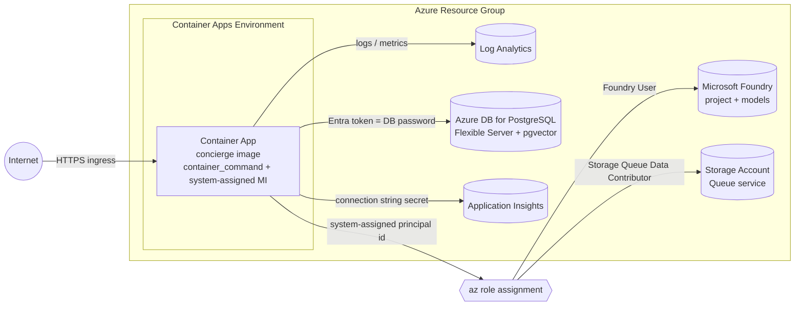

# Deploy to Azure Container Apps with Terraform

## Goal

Run the concierge Docker image on **Azure Container Apps (ACA)** using the
[`azure_container_apps`](https://github.com/ks6088ts/template-terraform/tree/main/infra/scenarios/azure_container_apps)
scenario from
[ks6088ts/template-terraform](https://github.com/ks6088ts/template-terraform),
and connect it to its Azure dependencies (Microsoft Foundry, Azure Database for
PostgreSQL, Azure Storage Queue, Application Insights) using **Microsoft Entra
ID / managed identity** instead of secrets wherever possible.

!!! info "Template capabilities used by this guide"
    This guide tracks the
    [`main`](https://github.com/ks6088ts/template-terraform/tree/main/infra/scenarios/azure_container_apps)
    branch of the scenario. The scenario already supports
    everything concierge needs out of the box — you do **not** need to fork or
    extend the module:

    | Capability | Scenario input | Notes |
    | :--- | :--- | :--- |
    | Override the start command | `container_command` (`list(string)`) | Required — the image's default `CMD` exits immediately |
    | Plain / secret env vars | `env_vars` (`list(object)`) | Each entry sets exactly one of `value` or `secret_name` |
    | Container App secrets | `secrets` (`list(object)`) | `name` + `value`, marked `sensitive` |
    | Managed identity | enabled automatically | A **system-assigned** identity is on by default; its principal id is exported as `container_app_identity_principal_id` |

    Because the identity is **system-assigned**, it only exists *after* the
    first `terraform apply`. The flow is therefore **deploy first, then grant
    RBAC roles** to the exported principal id. There is no `AZURE_CLIENT_ID`
    to set (that is only needed for user-assigned identities — see the last
    step).

## How it works



Every Azure SDK call in concierge authenticates through
[`DefaultAzureCredential`](https://learn.microsoft.com/en-us/python/api/azure-identity/azure.identity.defaultazurecredential)
(see [`concierge/settings/azure_postgres.py`](https://github.com/ks6088ts-labs/concierge/blob/main/concierge/settings/azure_postgres.py)
and [`concierge/settings/cloud_agent.py`](https://github.com/ks6088ts-labs/concierge/blob/main/concierge/settings/cloud_agent.py)).
On Container Apps with a system-assigned identity, `DefaultAzureCredential`
picks that identity automatically. Storage Queue and PostgreSQL **do not accept
connection strings or account keys** in this codebase — they are Entra-only, so
there is nothing to put in a secret for those two services; they rely entirely
on RBAC role assignments.

## Prerequisites

- An Azure subscription and the
  [Azure CLI](https://learn.microsoft.com/en-us/cli/azure/install-azure-cli)
  signed in (`az login`).
- [Terraform CLI](https://developer.hashicorp.com/terraform/install) `>= 1.6.0`.
- A clone of
  [ks6088ts/template-terraform](https://github.com/ks6088ts/template-terraform)
  on the `main` branch.
- A published concierge image. The CI pipelines push to:
  - GHCR: `ghcr.io/ks6088ts-labs/concierge:latest` (see
      [`ghcr-release.yaml`](https://github.com/ks6088ts-labs/concierge/blob/main/.github/workflows/ghcr-release.yaml))
  - Docker Hub: `ks6088ts/concierge:latest` (see
      [`docker-release.yaml`](https://github.com/ks6088ts-labs/concierge/blob/main/.github/workflows/docker-release.yaml))
- The Azure dependencies your chosen service needs (next section). You can
  create them with the other `template-terraform` scenarios
  ([`azure_microsoft_foundry`](https://github.com/ks6088ts/template-terraform/tree/main/infra/scenarios/azure_microsoft_foundry),
  [`azure_datastore`](https://github.com/ks6088ts/template-terraform/tree/main/infra/scenarios/azure_datastore))
  or reuse existing ones.

## Step 1 - Pick a service and know its requirements

A concierge image is one image with many entry points. The `container_command`
you pass to the Container App decides what runs. Pick one per Container App:

| Service | `container_command` | `container_port` | Health path | Azure dependencies |
| :--- | :--- | :---: | :--- | :--- |
| `todo-web` | `["todo-web"]` | 8080 | `/healthz` | none (memory) — optional PostgreSQL |
| `chat-web` | `["chat-web"]` | 8080 | `/healthz` | Microsoft Foundry (chat); optional PostgreSQL, realtime |
| `cloud-agent-web` | `["cloud-agent-web"]` | 8081 | `/healthz` | Storage Queue + (memory/PostgreSQL) |
| `cloud-agent` worker | `["cloud-agent-cli", "worker"]` | — | — | Storage Queue + Foundry + (memory/PostgreSQL) |

The ports and `/healthz` endpoints come straight from the code, e.g.
[`concierge/todo/infrastructure/web/app.py`](https://github.com/ks6088ts-labs/concierge/blob/main/concierge/todo/infrastructure/web/app.py)
(`port=8080`) and
[`concierge/cloud_agent/infrastructure/web/app.py`](https://github.com/ks6088ts-labs/concierge/blob/main/concierge/cloud_agent/infrastructure/web/app.py)
(`port=8081`). Set `container_port` to match the port the entry point listens
on.

!!! warning "The default image command exits immediately"
    The image's default `CMD` is `python -m concierge.core`
    ([`Dockerfile`](https://github.com/ks6088ts-labs/concierge/blob/main/Dockerfile)),
    which logs one line and returns. A Container App started with it would
    restart-loop. The `*-web` console scripts
    ([`pyproject.toml`](https://github.com/ks6088ts-labs/concierge/blob/main/pyproject.toml))
    are long-running web servers — always pass one through `container_command`.

!!! note "Scenario ingress and the worker"
    The scenario always provisions **external HTTPS ingress** on
    `container_port` (it does not expose ingress toggles). That is fine for the
    `*-web` services. The `cloud-agent` **worker** has no HTTP port; deploy it
    as a separate Container App with the worker command — it will still get an
    (unused) ingress endpoint, which is harmless.

### Environment variables and roles per service

| Dependency | `env_vars` (plain) | `secrets` | RBAC on the system-assigned identity |
| :--- | :--- | :--- | :--- |
| Foundry (chat / agents) | `AZURE_AI_PROJECT_ENDPOINT` | — | `Foundry User` on the Foundry **account** |
| Foundry realtime / image | `AZURE_AI_PROJECT_ENDPOINT_REALTIME`, `AZURE_AI_PROJECT_ENDPOINT_IMAGE` | — | covered by the same `Foundry User` account-scope assignment |
| PostgreSQL (`azure-postgres`) | `AZURE_DBHOST`, `AZURE_DBNAME`, `AZURE_DBUSER`, `AZURE_USE_ENTRA_AUTH=true` | — | identity registered as a Postgres role |
| Storage Queue (cloud_agent) | `CLOUD_AGENT_QUEUE_BACKEND=azure-storage-queue`, `CLOUD_AGENT_AZURE_STORAGE_ACCOUNT_URL` | — | `Storage Queue Data Contributor` |
| Application Insights | `CONCIERGE_TRACING_ENABLED=true` | `APPLICATIONINSIGHTS_CONNECTION_STRING` | — |

The full list of variables concierge reads is in
[`.env.template`](https://github.com/ks6088ts-labs/concierge/blob/main/.env.template).

!!! warning "Use `Foundry User`, not `Azure AI Developer`, for inference"
    Microsoft Foundry projects on the `*.services.ai.azure.com` endpoint are
    **not** authorized by the `Azure AI Developer` role. Per the
    [Foundry RBAC docs](https://learn.microsoft.com/en-us/azure/foundry/concepts/rbac-foundry),
    that role is scoped to Azure Machine Learning workspaces / Foundry hubs and
    does **not** grant inference on Foundry projects — calling a model with it
    returns `PermissionDeniedError: Error code: 403`. The role that grants
    inference (used by both the `foundry` responder and the `azure_ai:` agents)
    is **`Foundry User`** (recently renamed from `Azure AI User`, role id
    `53ca6127-db72-4b80-b1b0-d745d6d5456d`). Assign it at the **Foundry account**
    scope so all projects, plus the realtime and image endpoints, are covered.

!!! tip "Start with `todo-web`"
    `todo-web` with the in-memory backend needs **no** Azure dependency beyond
    the Container App itself. It is the fastest way to validate the image,
    ingress, and command override before adding identity and data services.

## Step 2 - Author `terraform.tfvars`

The scenario consumes the start command through `container_command`, plain
variables through `env_vars`, and secret-backed values through `secrets`
referenced by `secret_name`. Example for `chat-web` with Foundry and the
in-memory backend (simplest "real" service):

```hcl
# terraform.tfvars
name            = "concierge-chat"
location        = "japaneast"
container_image = "ghcr.io/ks6088ts-labs/concierge:latest"
container_port  = 8080
cpu             = 0.5
memory          = "1Gi"
min_replicas    = 1
max_replicas    = 3

# The start command — without this the image exits immediately.
container_command = ["chat-web"]

# Plain environment variables.
env_vars = [
  { name = "PROJECT_NAME", value = "concierge" },
  { name = "AZURE_AI_PROJECT_ENDPOINT", value = "https://<resource>.services.ai.azure.com/api/projects/<project>" },
  { name = "CHAT_BOT_AGENT_TYPE", value = "foundry" },
  { name = "CONCIERGE_TRACING_ENABLED", value = "true" },
  # Secret-backed: references the entry in `secrets` below.
  { name = "APPLICATIONINSIGHTS_CONNECTION_STRING", secret_name = "appinsights-connection-string" },
]

# Secret values stored as Container App secrets.
secrets = [
  { name = "appinsights-connection-string", value = "InstrumentationKey=...;IngestionEndpoint=https://<region>.in.applicationinsights.azure.com/" },
]

tags = {
  environment = "dev"
  owner       = "team-ai"
}
```

Each `env_vars` entry must set **exactly one** of `value` (plain text) or
`secret_name` (a reference to an entry in `secrets`) — the module enforces this
with a validation rule. Prefer `secrets` for anything sensitive (keys,
connection strings) so the value is stored as a Container App secret rather than
a plain environment value.

!!! note "Choosing the port"
    The `*-web` console scripts bind to a fixed port (8080 for `todo`/`chat`,
    8081 for `cloud-agent`), so set `container_port` to that value. To pick a
    different port, override the command with uvicorn directly, for example
    `container_command = ["uvicorn", "concierge.chat.infrastructure.web.app:create_app", "--factory", "--host", "0.0.0.0", "--port", "80"]`
    and set `container_port = 80`.

For `cloud-agent-web`, swap the command, port, and queue settings:

```hcl
container_command = ["cloud-agent-web"]
container_port    = 8081

env_vars = [
  { name = "CLOUD_AGENT_QUEUE_BACKEND", value = "azure-storage-queue" },
  { name = "CLOUD_AGENT_AZURE_STORAGE_ACCOUNT_URL", value = "https://<account>.queue.core.windows.net" },
]
```

!!! danger "Do not commit secrets"
    Keep real values out of source control. Put `secrets` in a git-ignored
    `*.auto.tfvars` file, pass them with `-var-file`, or inject them from your
    secret store / CI. Never hardcode keys in `main.tf` or a committed tfvars.

## Step 3 - Deploy (phase 1)

```shell
cd infra/scenarios/azure_container_apps

# azurerm v4 requires an explicit subscription id
export ARM_SUBSCRIPTION_ID=$(az account show --query id -o tsv)

terraform init
terraform plan -out tfplan
terraform apply tfplan

# Public URL and the identity principal id you will grant roles to
terraform output -raw container_app_url
terraform output -raw container_app_identity_principal_id
```

At this point the Container App is running with a **system-assigned managed
identity**, but it has no role assignments yet. A service that only needs the
in-memory backend and no Foundry (i.e. `todo-web`) is already fully functional.

## Step 4 - Grant RBAC roles to the identity

Use the exported principal id and assign only the roles your service needs.

```shell
PRINCIPAL_ID=$(terraform output -raw container_app_identity_principal_id)

# Foundry inference (chat / agents / realtime / image).
# Resolve the Foundry account resource id from its name (the first label of the
# AZURE_AI_PROJECT_ENDPOINT host, e.g. https://<account>.services.ai.azure.com/...).
FOUNDRY_ID=$(az cognitiveservices account list \
  --query "[?name=='<foundry-account-name>'].id | [0]" -o tsv)

# Use the role ID, not the name: the role was renamed Azure AI User -> Foundry
# User and the rename is still rolling out. Assign at the ACCOUNT scope.
az role assignment create \
  --assignee-object-id "$PRINCIPAL_ID" \
  --assignee-principal-type ServicePrincipal \
  --role "53ca6127-db72-4b80-b1b0-d745d6d5456d" \
  --scope "$FOUNDRY_ID"

# Storage Queue (cloud_agent)
az role assignment create \
  --assignee-object-id "$PRINCIPAL_ID" \
  --assignee-principal-type ServicePrincipal \
  --role "Storage Queue Data Contributor" \
  --scope "<storage-account-resource-id>"
```

Role assignments can take a few minutes to propagate. Restart the Container App
(or create a new revision) afterwards so it picks up a fresh token.

!!! tip "Still getting `PermissionDeniedError: Error code: 403` when chatting?"
    The token was issued but the identity is not authorized. Check, in order:
    (1) the role is **`Foundry User`** (id `53ca6127-...`), **not**
    `Azure AI Developer`; (2) it is scoped to the **Foundry account** (or at
    least the project) that `AZURE_AI_PROJECT_ENDPOINT` points at;
    (3) the assignment has propagated and the revision was restarted so a fresh
    token is minted; (4) for a user-assigned identity, `AZURE_CLIENT_ID` is set
    to its client id. Verify the assignment with
    `az role assignment list --assignee "$PRINCIPAL_ID" --scope "$FOUNDRY_ID" -o table`.

## Step 5 - Prepare PostgreSQL for Entra auth (only for `azure-postgres`)

Skip this step if your service uses the in-memory backend.

1. Enable **Microsoft Entra authentication** on the Flexible Server and set
   yourself as an Entra administrator
   ([how-to](https://learn.microsoft.com/en-us/azure/postgresql/flexible-server/how-to-configure-sign-in-azure-ad-authentication)).
2. Allowlist and create the **pgvector** extension
   ([how-to](https://learn.microsoft.com/en-us/azure/postgresql/extensions/how-to-use-pgvector)):
   add `VECTOR` to `azure.extensions`, then `CREATE EXTENSION vector;`.
3. Register the **system-assigned identity as a PostgreSQL role**. Connect as
   the Entra admin and run, using the identity's principal id from Step 3 as the
   object id:

    ```sql
    SELECT * FROM pgaadauth_create_principal_with_oid(
      'concierge-chat', '<container_app_identity_principal_id>', 'service'
    );
    GRANT ALL ON DATABASE postgres TO "concierge-chat";
    ```

4. Set `AZURE_DBUSER` to the same principal name (`concierge-chat` above) in
   `env_vars`. concierge fetches an Entra token via `DefaultAzureCredential` and
   uses it as the database password — leave `AZURE_DBPASSWORD` unset
   ([`concierge/settings/azure_postgres.py`](https://github.com/ks6088ts-labs/concierge/blob/main/concierge/settings/azure_postgres.py)).

    ```hcl
    env_vars = [
      { name = "CHAT_REPOSITORY_BACKEND", value = "azure-postgres" },
      { name = "AZURE_DBHOST", value = "<server>.postgres.database.azure.com" },
      { name = "AZURE_DBNAME", value = "postgres" },
      { name = "AZURE_DBUSER", value = "concierge-chat" },
      { name = "AZURE_USE_ENTRA_AUTH", value = "true" },
    ]
    ```

5. Re-run `terraform apply` to push the new `env_vars`.

!!! note "Network reachability"
    The Container App must reach the Flexible Server. For a quick start, allow
    public access with the server firewall. For production, give the Container
    Apps Environment VNet integration and use a Private Endpoint for the
    database.

## Step 6 - Verify

```shell
URL=$(terraform output -raw container_app_url)

# Health endpoint should return {"status":"ok"}
curl "$URL/healthz"
```

- **`todo-web`**: `curl "$URL/tasks"` returns an empty list; see
  [Todo REST API Reference](../todo/api.md).
- **`chat-web`**: open `$URL/` for the chat UI; see
  [Chat REST API Reference](../chat/api.md).
- **`cloud-agent-web`**: see [Cloud Agent REST API Reference](../cloud_agent/api.md).

Check the Container App logs in the Log Analytics workspace. A successful start
logs `Initialized ... FastAPI app`. Authentication failures from
`DefaultAzureCredential` (missing role, or an unregistered Postgres principal)
show up here first.

!!! tip "Diagnosing identity errors"
    `DefaultAzureCredential failed to retrieve a token` usually means the role
    assignment has not propagated yet (allow a few minutes and restart the
    app). For PostgreSQL, `password authentication failed` means the principal
    name in `AZURE_DBUSER` does not match the role created by
    `pgaadauth_create_principal_with_oid`, or the registered object id is not
    the system-assigned principal id from Step 3.

## Step 7 - (Optional) Use a user-assigned identity

A system-assigned identity is recreated if the Container App is deleted, which
also drops its role assignments. For long-lived environments a **user-assigned**
identity (created once, roles granted once, attached to many apps) is often
preferable. The module supports it via `identity_type` / `identity_ids`, but the
scenario does not expose those inputs yet, so you would either:

- add `identity_type = "UserAssigned"` and `identity_ids = [<uami-id>]` pass-through
  variables to the scenario and forward them to the `container_apps` module, or
- call the `container_apps` module directly from your own root module.

With a user-assigned identity you **must** also add
`{ name = "AZURE_CLIENT_ID", value = "<uami-client-id>" }` to `env_vars` so
`DefaultAzureCredential` selects the right identity. This is not needed for the
system-assigned default used in the steps above.

## Step 8 - Clean up

```shell
terraform destroy
```

This removes the Container App, environment, and Log Analytics created by the
scenario, along with the system-assigned identity and its role assignments.
Resources you created out-of-band (Foundry, PostgreSQL, Storage, Application
Insights) are not managed by this scenario and must be deleted separately.

## References

- [template-terraform — `azure_container_apps` scenario (`main`)](https://github.com/ks6088ts/template-terraform/tree/main/infra/scenarios/azure_container_apps)
- [Azure Container Apps documentation](https://learn.microsoft.com/en-us/azure/container-apps/)
- [`azurerm_container_app` resource](https://registry.terraform.io/providers/hashicorp/azurerm/latest/docs/resources/container_app)
- [Managed identities in Azure Container Apps](https://learn.microsoft.com/en-us/azure/container-apps/managed-identity)
- [Use Microsoft Entra authentication with Azure Database for PostgreSQL](https://learn.microsoft.com/en-us/azure/postgresql/flexible-server/how-to-configure-sign-in-azure-ad-authentication)
- [Authorize access to queues with Microsoft Entra ID](https://learn.microsoft.com/en-us/azure/storage/queues/authorize-access-azure-active-directory)
- [`DefaultAzureCredential` reference](https://learn.microsoft.com/en-us/python/api/azure-identity/azure.identity.defaultazurecredential)
- [`.env.template`](https://github.com/ks6088ts-labs/concierge/blob/main/.env.template) — every environment variable concierge reads
