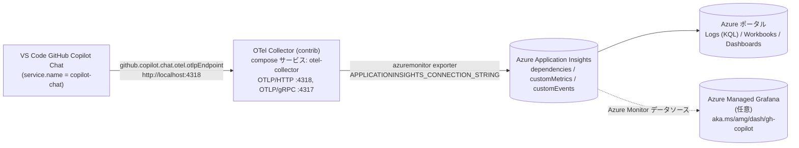

# VS Code GitHub Copilot を Application Insights で可視化する

## ゴール

VS Code **GitHub Copilot Chat** が出力する OpenTelemetry シグナル
（トレース、メトリック、イベント）を **Azure Application Insights** に
転送し、Copilot のオペレーション数・入出力トークン・チャットセッション・
ツール呼び出し・モデル別レイテンシを Azure ポータルから KQL
（`dependencies` / `customMetrics` テーブル）や Grafana / Workbook で
可視化できるようにします。

このページは
[Monitor AI coding agents with Grafana](https://learn.microsoft.com/ja-jp/azure/managed-grafana/grafana-opentelemetry-app-insights)
および
[Monitor agent usage with OpenTelemetry](https://code.visualstudio.com/docs/copilot/guides/monitoring-agents)
を本リポジトリ向けにレシピ化したものです。Collector・ポート・
Makefile ターゲットは同梱済みなので、Application Insights の接続文字列
を用意するだけで動きます。

!!! info "本ガイドのスコープ"
    ここで構築するパイプラインは、**VS Code Copilot Chat 拡張機能そのもの**
    （エディター上で操作するコーディングエージェント）の挙動を観測します。
    concierge アプリ内部の LangChain / LangGraph / Microsoft Agent Framework /
    GitHub Copilot SDK のトレースは扱いません — そちらは
    [ステップ 2 - 観測性 (トレース & MLflow)](02-observability.md)
    を参照してください。

## 想定読者

上流ガイド
[Monitor AI coding agents with Grafana](https://learn.microsoft.com/ja-jp/azure/managed-grafana/grafana-opentelemetry-app-insights#who-this-guide-is-for)
は、同一のダッシュボードを 4 つの読者像に向けて位置づけています。
concierge のセットアップもその枠組みをそのまま引き継ぎます。

* **プラットフォーム / 開発者体験チーム** — Copilot の採用状況、チーム別 /
  モデル別の支出、非効率な利用パターンを追跡。
* **エンジニアリングリーダー** — Copilot 活用度とデリバリー指標を相関させ、
  「この投資は見合っているか?」に答える材料を得る。
* **セキュリティ / ガバナンスチーム** — プロンプト・ツール呼び出し・モデル
  選択をコンプライアンス観点で監査
  （`github.copilot.chat.otel.captureContent` を `true` にする必要あり）。
* **個々の開発者・オンコール担当** — エージェントの挙動、遅いツール呼び出し、
  止まったセッションをセッション単位で調査。

## アーキテクチャ



Collector はローカルで OTLP を終端し、
[Azure Monitor exporter](https://github.com/open-telemetry/opentelemetry-collector-contrib/tree/main/exporter/azuremonitorexporter)
で Application Insights の各テーブルに書き込みます。

!!! note "代替経路: Azure Monitor へのネイティブ OTLP 取り込み"
    Azure Monitor は OTLP の直接取り込みもサポートしており、その場合は
    専用 Collector を経由しません。データの格納先は同じ Application
    Insights / Log Analytics のテーブルなので、本ガイドのダッシュボード
    はどちらの経路でも動作します。Collector をやめたい場合は
    [Azure Monitor への OTLP データ取り込み (プレビュー)](https://learn.microsoft.com/ja-jp/azure/azure-monitor/containers/opentelemetry-protocol-ingestion)
    を参照してください。本リポジトリが Collector 経路を採用している理由は、
    接続文字列を開発者端末側の Copilot 拡張に持たせずに済む点と、CI や
    devcontainer でも同じ構成が動く点です。
    (出典:
    [Monitor AI coding agents with Grafana — How it works](https://learn.microsoft.com/ja-jp/azure/managed-grafana/grafana-opentelemetry-app-insights#step-1-run-the-opentelemetry-collector))

!!! info "Collector / exporter のサポート区分"
    OpenTelemetry Collector (`contrib` を含む) および Azure Monitor
    exporter はオープンソース コンポーネントであり、サポートはコミュニティ
    経由 (issue は
    [`opentelemetry-collector-contrib`](https://github.com/open-telemetry/opentelemetry-collector-contrib/issues)
    に起票) で提供されます。Microsoft Azure サポートの対象は本パイプライン
    内の Azure サービス、すなわち Application Insights / Log Analytics /
    Grafana です。
    (出典:
    [Monitor AI coding agents with Grafana](https://learn.microsoft.com/ja-jp/azure/managed-grafana/grafana-opentelemetry-app-insights))

## 前提条件

* Log Analytics ワークスペースに紐付いた **Application Insights** リソース
  （未作成の場合は
  [作成手順](https://learn.microsoft.com/ja-jp/azure/azure-monitor/app/create-workspace-resource)
  を参照）。
* **VS Code 1.95 以降** と **GitHub Copilot Chat** 拡張機能（サインイン済み）。
* **Docker**（macOS / Windows は Docker Desktop、Linux はエンジン）。
* ローカルの TCP **4317** / **4318** ポートが空いていること。空けられない
  場合は `COPILOT_OTEL_COLLECTOR_OTLP_GRPC_PORT` /
  `COPILOT_OTEL_COLLECTOR_OTLP_HTTP_PORT` で別ポートに変更可能です。

## ステップ 1 - 接続文字列を設定

Azure ポータル → 対象の Application Insights → 概要 → *Essentials* →
*接続文字列* から値をコピーし、`.env` に追記します。

```dotenv
# .env
APPLICATIONINSIGHTS_CONNECTION_STRING=InstrumentationKey=00000000-0000-0000-0000-000000000000;IngestionEndpoint=https://<region>.in.applicationinsights.azure.com/;LiveEndpoint=https://<region>.livediagnostics.monitor.azure.com/
```

!!! warning "接続文字列はシークレット扱い"
    この値があれば誰でも当該 Application Insights にデータを書き込めます。
    `.env` は `.gitignore` 済みですが、漏洩した場合は速やかにリソース側で
    キーを再生成してください。

オーバーライド可能なポート設定（既定値）。

```dotenv
# COPILOT_OTEL_COLLECTOR_OTLP_HTTP_PORT=4318
# COPILOT_OTEL_COLLECTOR_OTLP_GRPC_PORT=4317
```

詳細は
[`.env.template`](https://github.com/ks6088ts-labs/concierge/blob/main/.env.template)
の対応ブロックを参照してください。

## ステップ 2 - OTel Collector を起動

Collector は
[`compose.yml`](https://github.com/ks6088ts-labs/concierge/blob/main/compose.yml)
の `otel-collector` サービスとして同梱されています。誤起動を防ぐため
`copilot-otel` という Docker Compose プロファイルでガードしており、通常の
`docker compose up` では起動しません。

```bash
make copilot-otel-up    # docker compose --profile copilot-otel up -d otel-collector
make copilot-otel-logs  # Collector ログを追尾
make copilot-otel-down  # docker compose --profile copilot-otel down
```

利用イメージは `azuremonitor` exporter を同梱する唯一の公式ディストリ
ビューションである
[`otel/opentelemetry-collector-contrib:latest`](https://github.com/open-telemetry/opentelemetry-collector-contrib)
です。コンテナにマウントされる設定ファイル
[`otel-collector-config.yaml`](https://github.com/ks6088ts-labs/concierge/blob/main/otel-collector-config.yaml)
は `${env:APPLICATIONINSIGHTS_CONNECTION_STRING}` で接続文字列を環境変数から
取り込みます。

!!! tip "起動確認"
    正常に起動するとログに `Everything is ready. Begin running and
    processing data.` が現れ、その後はエラー行が出ません。Azure 側に
    到達できない場合は `make copilot-otel-logs` で
    `failed to export to Azure Monitor` のリトライ警告が周期的に流れます。

## ステップ 3 - VS Code Copilot を Collector に向ける

VS Code Copilot Chat はバージョン 1.95 以降で OTel を発火させる設定を
備えています。`settings.json`（ユーザー設定でもワークスペース設定でも
可、後者ならリポジトリ単位で完結）に次を追加します。

```json title="settings.json"
{
    "github.copilot.chat.otel.enabled": true,
    "github.copilot.chat.otel.exporterType": "otlp-http",
    "github.copilot.chat.otel.otlpEndpoint": "http://localhost:4318",
    "github.copilot.chat.otel.captureContent": true
}
```

| 設定 | 役割 |
| :--- | :--- |
| `github.copilot.chat.otel.enabled` | Copilot 拡張で OTel SDK をロード。この値が `true` でないと一切送信されません。 |
| `github.copilot.chat.otel.exporterType` | `otlp-http` は Collector の `:4318` レシーバーに対応。gRPC で送りたい場合は `otlp-grpc` と `http://localhost:4317` を組み合わせます。 |
| `github.copilot.chat.otel.otlpEndpoint` | ホスト側に公開するポート（`COPILOT_OTEL_COLLECTOR_OTLP_HTTP_PORT`、既定 `4318`）と一致させます。 |
| `github.copilot.chat.otel.captureContent` | プロンプト・応答・ツール引数の中身まで span に含めます。機密情報を含む環境では外してください。 |

`settings.json` を編集したら VS Code をリロード（`Developer: Reload
Window`）して、Copilot 拡張に設定を読み直させます。

!!! note "環境変数の方が優先"
    `OTEL_EXPORTER_OTLP_ENDPOINT` / `COPILOT_OTEL_ENABLED` /
    `COPILOT_OTEL_CAPTURE_CONTENT` などの環境変数が VS Code プロセスに
    設定されている場合は `settings.json` より優先されます。詳細は
    [環境変数一覧](https://code.visualstudio.com/docs/copilot/guides/monitoring-agents#_environment-variables)
    を参照してください。

## ステップ 4 - データ送信と Application Insights での確認

1. VS Code の Chat / Inline Chat / Agent などで Copilot に何か質問
   します（1 行の質問でも十分なテレメトリが生成されます）。
2. Collector のバッチング遅延 + Application Insights の取り込み遅延の
   ため、1 分ほど待ちます。
3. Azure ポータル → 対象 Application Insights → **Logs** で次の KQL を実行。

```kusto
// VS Code Copilot からの依存関係 (LLM API 呼び出し / ツール呼び出し)
dependencies
| where timestamp > ago(1h)
| where cloud_RoleName == "copilot-chat"
| project timestamp, name, target, duration, success, customDimensions
| order by timestamp desc
| take 50
```

```kusto
// GenAI セマンティック規約のメトリクス (トークン使用量, リクエスト時間)
customMetrics
| where timestamp > ago(1h)
| where name startswith "gen_ai." or name startswith "copilot_chat."
| summarize count(), avg(value) by name
| order by name asc
```

```kusto
// Copilot 拡張が発火するツール別呼び出し回数
customMetrics
| where timestamp > ago(24h)
| where name == "copilot_chat.tool.call.count"
| extend tool = tostring(customDimensions["gen_ai.tool.name"])
| summarize calls = sum(value) by tool
| order by calls desc
```

行が返れば疎通完了です。空のままなら下記の
[トラブルシューティング](#トラブルシューティング)を確認します。

!!! tip "プリセットの Grafana ダッシュボードを使う"
    Azure Managed Grafana を同じサブスクリプションで運用しているなら、
    Azure Monitor データソースを設定したうえで
    [aka.ms/amg/dash/gh-copilot](https://aka.ms/amg/dash/gh-copilot)
    からプリビルドのダッシュボードをインポートすると、オペレーション数 /
    入出力トークン / チャットセッション / ツール呼び出し / モデル別
    レイテンシ (平均所要時間および P50/P90 TTFT) のパネルがそのまま
    表示されます — モデル構成のドリフトや遅いツールを発見するのに有効です。
    (出典:
    [Monitor AI coding agents with Grafana — GitHub Copilot ダッシュボード](https://learn.microsoft.com/ja-jp/azure/managed-grafana/grafana-opentelemetry-app-insights#github-copilot))

!!! tip "Grafana を持っていない場合: Azure ポータルのネイティブダッシュボード"
    同じダッシュボードは **Azure Monitor dashboards with Grafana** として
    Azure ポータル上でもネイティブに利用でき、専用の Grafana インスタンス
    は不要です。詳細は
    [Azure Monitor ダッシュボードを Grafana で使う](https://learn.microsoft.com/ja-jp/azure/azure-monitor/visualize/visualize-use-grafana-dashboards)
    を参照してください。
    (出典:
    [Monitor AI coding agents with Grafana — ステップ 4](https://learn.microsoft.com/ja-jp/azure/managed-grafana/grafana-opentelemetry-app-insights#step-4-import-the-dashboards-into-grafana-or-access-them-in-azure-portal))

## トラブルシューティング

??? failure "`make copilot-otel-up` は成功するが Collector が落ちる / azuremonitor エラーが出る"
    もっとも多い原因は `APPLICATIONINSIGHTS_CONNECTION_STRING` が
    未設定または空であることです。Compose サービス定義では
    ソフトデフォルト（`${VAR:-}`）を使って、他サービスの
    `docker compose up` を妨げないようにしているため、設定不備は
    Collector 自身が検出します。`make copilot-otel-logs` を見ると
    `azuremonitor` exporter に `failed to parse connection string` や
    `connection_string is required` のような明示的なエラーが出ます。

??? failure "5 分待っても Application Insights にデータが現れない"
    1. `make copilot-otel-logs` を確認。`failed to export to Azure
       Monitor` のログが続く場合は接続文字列の誤り、リソースの削除、
       あるいは `*.in.applicationinsights.azure.com` への egress 制限
       が原因です。
    2. Copilot 側が OTLP を送っているかを確認。拡張機能側はエクスポート
       エラーを抑制するため、最も簡単な切り分けはホストから
       `curl http://localhost:4318/v1/traces` を叩くこと（`405` が返れ
       ばレシーバーは生きており、POST のみ許可されている状態）。
    3. `settings.json` 編集後は VS Code ウィンドウをリロード。拡張機能
       は起動時に一度だけ OTel 設定を読みます。
    4. 通常 1 分以内に取り込まれますが、コールド状態の App Insights では
       数分かかることがあります。少し待ってから再度 KQL を実行します。

??? failure "ポート 4317 / 4318 が既に使用中"
    Aspire Dashboard やローカル Jaeger など別の OTLP バックエンドが同じ
    ポートを掴んでいます。停止するか、ホスト側ポートを変更したうえで
    VS Code 側のエンドポイントも揃えます。

    ```dotenv
    # .env
    COPILOT_OTEL_COLLECTOR_OTLP_HTTP_PORT=14318
    ```

    ```json
    // settings.json
    {
        "github.copilot.chat.otel.otlpEndpoint": "http://localhost:14318"
    }
    ```

??? failure "プロンプトやツール引数が span に含まれない"
    `github.copilot.chat.otel.captureContent` が `true` である必要が
    あります。`github.copilot.chat.otel.maxAttributeSizeChars`
    （既定 `0` = 切詰なし）に正の値を設定していると、それを超える
    属性は切り詰められます。

## 次のステップ

テレメトリが流れ始めたら、同じ Application Insights データを起点に
いくつかの応用ワークフローへ展開できます。上流ガイドでは concierge の
構成にもそのまま当てはまる 3 つの方向性が挙げられています
([出典](https://learn.microsoft.com/ja-jp/azure/managed-grafana/grafana-opentelemetry-app-insights#where-to-go-from-here))。

* **対象エージェントを増やす。** Collector は OTLP を喋るあらゆるツールを
  受け付けます。Claude Code / OpenClaw / 自作エージェント / concierge の
  LangGraph スタックそのものを同じ `:4318` に向ければ、本パイプラインを
  共有できます。
* **アラートを設定する。**
  [Application Insights のアラート ルール](https://learn.microsoft.com/ja-jp/azure/azure-monitor/alerts/alerts-overview)
  または Grafana アラートを、このページに載っている KQL に対して構成します。
  例えば LLM API のエラー率の継続、P90 TTFT の閾値超過、暴走ループを示唆する
  日次トークン使用量のスパイクなど。
* **関係者に共有する。** Grafana プレイリストにダッシュボードを固定する、
  あるいは特定のパネルをチームのステータスページに埋め込むなどして、
  採用状況・コスト・信頼性をマネジメント層の目に触れ続けるようにします。

## 関連リンク

* [Monitor AI coding agents with Grafana](https://learn.microsoft.com/ja-jp/azure/managed-grafana/grafana-opentelemetry-app-insights) — 本セットアップの元になっているガイド
* [Monitor agent usage with OpenTelemetry](https://code.visualstudio.com/docs/copilot/guides/monitoring-agents) — VS Code Copilot 側の属性 / メトリック全網羅
* [Application Insights 接続文字列](https://learn.microsoft.com/ja-jp/azure/azure-monitor/app/sdk-connection-string)
* [OTel Collector 向け Azure Monitor exporter](https://github.com/open-telemetry/opentelemetry-collector-contrib/tree/main/exporter/azuremonitorexporter)
* [ステップ 2 - 観測性 (トレース & MLflow)](02-observability.md) — concierge 自身のコードパスを対象とした観測
