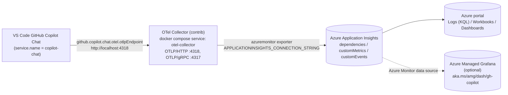

# Monitor VS Code GitHub Copilot via Application Insights

## Goal

Forward the OpenTelemetry signals emitted by VS Code **GitHub Copilot Chat**
(traces, metrics, and events) to **Azure Application Insights**, so Copilot
operations, input/output tokens, chat sessions, tool calls, and per-model
latency are queryable from the Azure portal (KQL on `dependencies` /
`customMetrics`) and any Grafana / Workbook dashboard layered on top.

This page is the concierge-specific recipe of
[Monitor AI coding agents with Grafana](https://learn.microsoft.com/en-us/azure/managed-grafana/grafana-opentelemetry-app-insights)
and the upstream
[Monitor agent usage with OpenTelemetry](https://code.visualstudio.com/docs/copilot/guides/monitoring-agents)
guide. The collector, ports, and Makefile targets are bundled in this
repository so you only need to provide the Application Insights connection
string.

!!! info "Scope of this guide"
    This pipeline observes the **VS Code Copilot Chat extension itself** —
    the editor-side coding agent you interact with. It is independent of
    the concierge-internal observability covered in
    [Step 2 - Observability (Tracing & MLflow)](02-observability.md),
    which traces concierge's own LangChain / LangGraph / Microsoft Agent
    Framework / GitHub Copilot SDK code paths.

## Who this guide is for

The upstream
[Monitor AI coding agents with Grafana](https://learn.microsoft.com/en-us/azure/managed-grafana/grafana-opentelemetry-app-insights#who-this-guide-is-for)
guide frames the same dashboard for four audiences. The concierge setup
inherits those framings:

* **Platform / developer experience teams** — track Copilot adoption, spend
  by team and model, and surface inefficient usage patterns.
* **Engineering leaders** — correlate Copilot activity with delivery
  signals and answer "is this investment paying off?".
* **Security and governance teams** — audit prompts, tool invocations,
  and model choices for compliance review (requires
  `github.copilot.chat.otel.captureContent` to be `true`).
* **Individual developers and on-call engineers** — debug agent
  behavior, slow tool calls, or stuck sessions on a per-session basis.

## How it works



The collector terminates OTLP locally and uses the
[Azure Monitor exporter](https://github.com/open-telemetry/opentelemetry-collector-contrib/tree/main/exporter/azuremonitorexporter)
to push the signals into the same Application Insights tables you already
query from the portal.

!!! note "Alternative: native OTLP ingestion into Azure Monitor"
    Azure Monitor also accepts OTLP directly, without a dedicated
    collector hop. The dashboards in this guide work with either path
    because the data lands in the same Application Insights /
    Log Analytics tables. See
    [Ingest OTLP data into Azure Monitor (Preview)](https://learn.microsoft.com/en-us/azure/azure-monitor/containers/opentelemetry-protocol-ingestion)
    if you prefer to drop the local collector. This repository ships the
    collector path because it keeps the connection string off your
    developer machine's Copilot extension and works the same way on CI /
    devcontainers.
    (Source:
    [Monitor AI coding agents with Grafana — How it works](https://learn.microsoft.com/en-us/azure/managed-grafana/grafana-opentelemetry-app-insights#step-1-run-the-opentelemetry-collector).)

!!! info "Support boundaries for the collector and exporter"
    The OpenTelemetry Collector (including the `contrib` distribution)
    and the Azure Monitor exporter are open-source components supported
    through community channels (file issues against
    [`opentelemetry-collector-contrib`](https://github.com/open-telemetry/opentelemetry-collector-contrib/issues)).
    Microsoft Azure Support covers the Azure services in this pipeline —
    Application Insights, Log Analytics, and Grafana.
    (Source:
    [Monitor AI coding agents with Grafana](https://learn.microsoft.com/en-us/azure/managed-grafana/grafana-opentelemetry-app-insights).)

## Prerequisites

* An **Application Insights** resource attached to a Log Analytics
  workspace.
  ([Create one](https://learn.microsoft.com/en-us/azure/azure-monitor/app/create-workspace-resource)
  if you do not have one yet.)
* **VS Code 1.95+** with **GitHub Copilot Chat** installed and signed in.
* **Docker** (Docker Desktop on macOS / Windows, or the engine on Linux).
* Local TCP ports **4317** and **4318** free. Override the host-side ports
  via `COPILOT_OTEL_COLLECTOR_OTLP_GRPC_PORT` /
  `COPILOT_OTEL_COLLECTOR_OTLP_HTTP_PORT` if you cannot free them.

## Step 1 - Configure the connection string

Copy your Application Insights **Connection String** (Azure portal → your
Application Insights resource → Overview → *Essentials* → *Connection
String*) into `.env`:

```dotenv
# .env
APPLICATIONINSIGHTS_CONNECTION_STRING=InstrumentationKey=00000000-0000-0000-0000-000000000000;IngestionEndpoint=https://<region>.in.applicationinsights.azure.com/;LiveEndpoint=https://<region>.livediagnostics.monitor.azure.com/
```

!!! warning "Treat the connection string as a secret"
    Anyone with the connection string can write telemetry into your
    Application Insights resource. `.env` is already in `.gitignore`;
    keep it out of source control and rotate the resource if the value
    leaks.

Optional overrides (defaults shown):

```dotenv
# COPILOT_OTEL_COLLECTOR_OTLP_HTTP_PORT=4318
# COPILOT_OTEL_COLLECTOR_OTLP_GRPC_PORT=4317
```

See the corresponding section in
[`.env.template`](https://github.com/ks6088ts-labs/concierge/blob/main/.env.template)
for the full annotated block.

## Step 2 - Start the OTel Collector

The collector ships as the `otel-collector` service in
[`compose.yml`](https://github.com/ks6088ts-labs/concierge/blob/main/compose.yml),
gated behind the `copilot-otel` Docker Compose profile so it never starts
on a plain `docker compose up`.

```bash
make copilot-otel-up    # docker compose --profile copilot-otel up -d otel-collector
make copilot-otel-logs  # tail collector logs
make copilot-otel-down  # docker compose --profile copilot-otel down
```

The image is
[`otel/opentelemetry-collector-contrib:latest`](https://github.com/open-telemetry/opentelemetry-collector-contrib),
the only public distribution that bundles the `azuremonitor` exporter. The
configuration mounted into the container lives at
[`otel-collector-config.yaml`](https://github.com/ks6088ts-labs/concierge/blob/main/otel-collector-config.yaml)
and reads the connection string from the environment via
`${env:APPLICATIONINSIGHTS_CONNECTION_STRING}`.

!!! tip "Verify the collector is healthy"
    A successful boot logs `Everything is ready. Begin running and
    processing data.` followed by no further error lines. If the
    `azuremonitor` exporter cannot reach Azure, you will see retry
    warnings every few seconds in `make copilot-otel-logs`.

## Step 3 - Point VS Code Copilot at the collector

VS Code Copilot Chat is OTel-aware as of recent releases. Add the
following to your VS Code `settings.json` (User or Workspace; Workspace
keeps the change local to this repo):

```json title="settings.json"
{
    "github.copilot.chat.otel.enabled": true,
    "github.copilot.chat.otel.exporterType": "otlp-http",
    "github.copilot.chat.otel.otlpEndpoint": "http://localhost:4318",
    "github.copilot.chat.otel.captureContent": true
}
```

| Setting | Why |
| :--- | :--- |
| `github.copilot.chat.otel.enabled` | Loads the OTel SDK in the Copilot extension. No data is emitted without this flag. |
| `github.copilot.chat.otel.exporterType` | `otlp-http` matches the collector's `:4318` receiver. Use `otlp-grpc` with `http://localhost:4317` instead if you prefer gRPC. |
| `github.copilot.chat.otel.otlpEndpoint` | Match the host-side port you exposed (`COPILOT_OTEL_COLLECTOR_OTLP_HTTP_PORT`, default `4318`). |
| `github.copilot.chat.otel.captureContent` | Adds full prompt, response, and tool argument payloads to spans. Drop this in environments with sensitive content. |

After editing `settings.json`, reload the VS Code window
(`Developer: Reload Window`) so the Copilot extension picks up the new
configuration.

!!! note "Environment variables override settings"
    `OTEL_EXPORTER_OTLP_ENDPOINT`, `COPILOT_OTEL_ENABLED`, and
    `COPILOT_OTEL_CAPTURE_CONTENT` take precedence over the
    `settings.json` values when present in the VS Code process
    environment. See the upstream
    [environment variables table](https://code.visualstudio.com/docs/copilot/guides/monitoring-agents#_environment-variables)
    for the full list.

## Step 4 - Generate traffic and verify in Application Insights

1. Trigger Copilot Chat from the VS Code Chat / Inline Chat / Agent
   surfaces (a single one-line prompt is enough to produce telemetry).
2. Wait roughly one minute for the collector batcher and Application
   Insights ingestion to settle.
3. In the Azure portal, open the Application Insights resource → **Logs**
   and run any of the following KQL queries:

```kusto
// Per-call dependencies (LLM API calls, tool calls) from VS Code Copilot
dependencies
| where timestamp > ago(1h)
| where cloud_RoleName == "copilot-chat"
| project timestamp, name, target, duration, success, customDimensions
| order by timestamp desc
| take 50
```

```kusto
// GenAI metric histograms (token usage, request duration)
customMetrics
| where timestamp > ago(1h)
| where name startswith "gen_ai." or name startswith "copilot_chat."
| summarize count(), avg(value) by name
| order by name asc
```

```kusto
// Per-tool invocation counts emitted by the Copilot extension
customMetrics
| where timestamp > ago(24h)
| where name == "copilot_chat.tool.call.count"
| extend tool = tostring(customDimensions["gen_ai.tool.name"])
| summarize calls = sum(value) by tool
| order by calls desc
```

Rows mean the pipeline is working end to end. If the tables stay empty,
walk through [Troubleshooting](#troubleshooting) below.

!!! tip "Light up the prebuilt Grafana dashboard"
    If you also run Azure Managed Grafana with an Azure Monitor data
    source attached to the same subscription, import the prebuilt
    dashboard at [aka.ms/amg/dash/gh-copilot](https://aka.ms/amg/dash/gh-copilot)
    to get operations, input/output tokens, chat sessions, tool calls,
    and per-model latency (average duration and P50/P90 TTFT) — useful
    for spotting model-mix drift and slow tools.
    (Source:
    [Monitor AI coding agents with Grafana — GitHub Copilot dashboard](https://learn.microsoft.com/en-us/azure/managed-grafana/grafana-opentelemetry-app-insights#github-copilot).)

!!! tip "Don't have Grafana? Use the native Azure portal dashboards"
    The same dashboards are also available natively in the Azure portal
    as **Azure Monitor dashboards with Grafana**, with no separate
    Grafana instance required. See
    [Use Azure Monitor dashboards with Grafana](https://learn.microsoft.com/en-us/azure/azure-monitor/visualize/visualize-use-grafana-dashboards).
    (Source:
    [Monitor AI coding agents with Grafana — Step 4](https://learn.microsoft.com/en-us/azure/managed-grafana/grafana-opentelemetry-app-insights#step-4-import-the-dashboards-into-grafana-or-access-them-in-azure-portal).)

## Troubleshooting

??? failure "`make copilot-otel-up` returns but the collector exits or logs azuremonitor errors"
    The most common cause is a missing or empty
    `APPLICATIONINSIGHTS_CONNECTION_STRING`. The compose service uses a
    soft default (`${VAR:-}`) so `docker compose up` keeps working for
    unrelated services, which means the collector itself is what
    surfaces the misconfiguration. Inspect `make copilot-otel-logs`:
    the `azuremonitor` exporter will log a clear error such as
    `failed to parse connection string` or `connection_string is required`
    when the variable is unset.

??? failure "Application Insights tables stay empty after ~5 minutes"
    1. `make copilot-otel-logs` — if the collector logs `failed to export
       to Azure Monitor`, the connection string is wrong, expired, or
       your environment cannot reach
       `*.in.applicationinsights.azure.com`.
    2. Confirm Copilot is actually emitting OTLP. The extension swallows
       export errors silently, so the simplest check is a
       `curl http://localhost:4318/v1/traces` from the host — a `405`
       response confirms the receiver is reachable (only POST is
       allowed).
    3. Reload the VS Code window after editing `settings.json`. The
       extension reads OTel settings at activation time only.
    4. Ingestion latency is normally under a minute, but can spike to a
       few minutes on cold App Insights resources. Re-run the KQL after
       a short wait.

??? failure "Port 4317 / 4318 already in use"
    Another local OTLP backend (for example, an Aspire Dashboard or a
    standalone Jaeger) is bound to the same port. Either stop it, or
    remap the host-side port and update the VS Code endpoint:

    ```dotenv
    # .env
    COPILOT_OTEL_COLLECTOR_OTLP_HTTP_PORT=14318
    ```

    ```json
    // settings.json
    {
        "github.copilot.chat.otel.otlpEndpoint": "http://localhost:14318"
    }
    ```

??? failure "Prompts / tool arguments are missing from spans"
    `github.copilot.chat.otel.captureContent` must be `true`. The
    extension also truncates content above
    `github.copilot.chat.otel.maxAttributeSizeChars` (default `0`,
    meaning no truncation) — only relevant when you have explicitly
    set that value.

## Where to go from here

Once telemetry is flowing, the same Application Insights data unlocks
several follow-on workflows. The upstream guide highlights three that
apply directly to the concierge setup
([source](https://learn.microsoft.com/en-us/azure/managed-grafana/grafana-opentelemetry-app-insights#where-to-go-from-here)):

* **Add more agents.** The collector accepts OTLP from any tool. Point
  additional agents (Claude Code, OpenClaw, in-house agents, the
  concierge LangGraph stack itself) at the same `:4318` endpoint and
  they will share the pipeline.
* **Set alerts.** Use
  [Application Insights alert rules](https://learn.microsoft.com/en-us/azure/azure-monitor/alerts/alerts-overview)
  or Grafana alerting on the KQL in this page — for example, sustained
  LLM API error rate, P90 TTFT above a threshold, or daily token usage
  spikes that imply a runaway agent loop.
* **Share with stakeholders.** Pin the Grafana / Workbook dashboards to
  a playlist, or embed selected panels in team status pages so adoption,
  cost, and reliability stay visible to leadership.

## Related links

* [Monitor AI coding agents with Grafana](https://learn.microsoft.com/en-us/azure/managed-grafana/grafana-opentelemetry-app-insights) — upstream guide this setup is based on
* [Monitor agent usage with OpenTelemetry](https://code.visualstudio.com/docs/copilot/guides/monitoring-agents) — full attribute / metric reference for VS Code Copilot
* [Application Insights connection strings](https://learn.microsoft.com/en-us/azure/azure-monitor/app/sdk-connection-string)
* [Azure Monitor exporter for the OTel Collector](https://github.com/open-telemetry/opentelemetry-collector-contrib/tree/main/exporter/azuremonitorexporter)
* [Step 2 - Observability (Tracing & MLflow)](02-observability.md) — observability for concierge's own code paths
