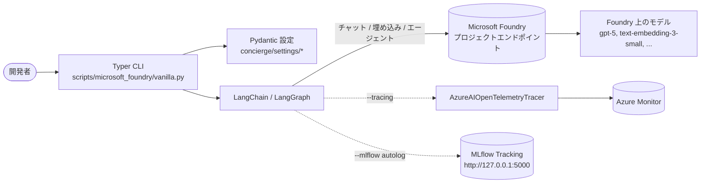

# ハンズオンチュートリアル

ようこそ。本ガイドは **concierge** リポジトリの現在の実装を GitHub Issue
の流れに沿って段階的に理解するハンズオンです。実装済みコードを単に読むの
ではなく、各 Issue が「なぜ」「何を」変えたのかを追体験しながら手を動かせ
る構成にしています。

## このチュートリアルの目的

このリポジトリは [Microsoft Foundry](https://learn.microsoft.com/ja-jp/azure/foundry/)
上で [LangChain](https://docs.langchain.com/) / [LangGraph](https://docs.langchain.com/oss/python/langgraph/quickstart)
を使った LLM アプリケーションを始めるためのテンプレートです。Issue 単位で
作業の流れを追うことで、各実装が **どんな課題を解決するために入ったのか**
を理解できます。

## Issue とステップの対応表

| ステップ | テーマ                                  | GitHub Issue | 状態   |
| :------- | :-------------------------------------- | :----------- | :----- |
| 1        | Microsoft Foundry + LangChain のセットアップ | [#3](https://github.com/ks6088ts-labs/concierge/issues/3) | Closed |
| 2a       | Azure Monitor / Foundry によるトレーシング    | [#5](https://github.com/ks6088ts-labs/concierge/issues/5) | Closed |
| 2b       | MLflow によるローカル評価                   | [#8](https://github.com/ks6088ts-labs/concierge/issues/8) | Closed |
| 3a       | クリーンアーキテクチャの適用                | [#6](https://github.com/ks6088ts-labs/concierge/issues/6) | Open   |
| 3b       | IaC によるインフラ構築                      | [#10](https://github.com/ks6088ts-labs/concierge/issues/10) | Open   |
| 4        | Docker Compose 上の PostgreSQL (pgvector) で CRUD | -    | -      |

ステップ 1〜2 はすでにマージ済みのコードに対応します。ステップ 3 は今後の
作業として Open Issue を起点に進める内容です。ステップ 4 では Docker で動く
PostgreSQL を永続的なベクトルストアとして使う構成を追加しました。

## 全体アーキテクチャ

## 前提条件

以下のツールを事前にインストール・設定してください。バージョンは本リポジトリ
の [`pyproject.toml`](https://github.com/ks6088ts-labs/concierge/blob/main/pyproject.toml)
と [`Makefile`](https://github.com/ks6088ts-labs/concierge/blob/main/Makefile)
に揃えています。

- [Python 3.10 以上](https://www.python.org/downloads/)
- [uv](https://docs.astral.sh/uv/getting-started/installation/): 依存解決と
  仮想環境を `make` ターゲットから一元管理するために利用します。
- [GNU Make](https://www.gnu.org/software/make/): `uv` コマンドを包む薄い
  ラッパーです。
- [Microsoft Foundry](https://ai.azure.com/) を利用可能な Azure サブスクリプ
  ション。チャット / 埋め込みモデルがデプロイ済みであること。例ではコード
  上の既定デプロイ名 (`gpt-5` と `text-embedding-3-small`) を使いますが、
  自分のプロジェクトで利用可能なデプロイ名に置き換えてください。
- [Azure CLI](https://learn.microsoft.com/ja-jp/cli/azure/install-azure-cli)
  にサインイン済み (`az login`) であること。`DefaultAzureCredential` が
  認証情報として参照します。

!!! tip "なぜ `DefaultAzureCredential` を使うのか"
    本リポジトリの CLI は
    [`DefaultAzureCredential`](https://learn.microsoft.com/ja-jp/python/api/azure-identity/azure.identity.defaultazurecredential)
    で認証します。`az login` / マネージド ID / 環境変数 / 開発者資格情報を
    自動的にフォールバックして使うため、API キーを自分で管理する必要があり
    ません。

## 各ステップの読み方

すべてのステップは同じ構造で記述しています。

1. **ゴール**: そのステップで何が手に入るか。
2. **参照 Issue**: 元になった GitHub Issue。
3. **背景**: なぜ必要なのか / なぜこの設計なのか。
4. **手順**: 実行できるコマンドと、理解に必要なコード抜粋。
5. **動作確認**: 期待される出力。
6. **トラブルシューティング**: よくあるつまずきと対処。

それでは [ステップ 1 - Microsoft Foundry + LangChain](01-foundry-langchain.md)
から始めましょう。
