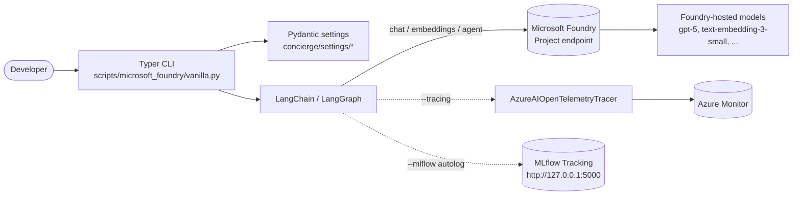

# Hands-on Tutorial

Welcome to the **concierge** hands-on tutorial. This guide walks you through
the current application step by step, using the actual GitHub Issues that
shaped the codebase as the storyline.

Each step links back to the originating Issue, explains the **why** behind the
change, and shows runnable commands plus selected code excerpts.

## Why follow this tutorial?

The repository is a template for building LLM applications on top of
[Microsoft Foundry](https://learn.microsoft.com/en-us/azure/foundry/) with
[LangChain](https://docs.langchain.com/) and
[LangGraph](https://docs.langchain.com/oss/python/langgraph/quickstart). Rather
than reading the finished code in isolation, you will trace it issue by issue
so the design decisions stay visible.

## Issue-to-step map

| Step | Topic                                | GitHub Issue | Status |
| :--- | :----------------------------------- | :----------- | :----- |
| 1    | Microsoft Foundry + LangChain setup  | [#3](https://github.com/ks6088ts-labs/concierge/issues/3) | Closed |
| 2a   | Tracing with Azure Monitor / Foundry | [#5](https://github.com/ks6088ts-labs/concierge/issues/5) | Closed |
| 2b   | Local evaluation with MLflow         | [#8](https://github.com/ks6088ts-labs/concierge/issues/8) | Closed |
| 3a   | Apply Clean Architecture             | [#6](https://github.com/ks6088ts-labs/concierge/issues/6) | Open   |
| 3b   | Provision infrastructure via IaC     | [#10](https://github.com/ks6088ts-labs/concierge/issues/10) | Open  |
| 4    | PostgreSQL (pgvector) CRUD via Docker Compose | -    | -      |
| 5    | Azure Database for PostgreSQL (pgvector) CRUD | [#14](https://github.com/ks6088ts-labs/concierge/issues/14) | Open |

Steps 1 and 2 mirror code that is already merged. Step 3 is forward-looking and
points to the open issues you can pick up next. Step 4 adds a persistent vector
store option backed by Docker-hosted PostgreSQL, and Step 5 reuses the same
CRUD flow against a managed Azure Database for PostgreSQL Flexible Server.

## High-level architecture

## Prerequisites

Before starting, make sure your machine has the following installed. Versions
align with what the repository's [`pyproject.toml`](https://github.com/ks6088ts-labs/concierge/blob/main/pyproject.toml)
and [`Makefile`](https://github.com/ks6088ts-labs/concierge/blob/main/Makefile)
expect.

- [Python 3.10+](https://www.python.org/downloads/)
- [uv](https://docs.astral.sh/uv/getting-started/installation/) - dependency
  and virtual-env manager used by every `make` target
- [GNU Make](https://www.gnu.org/software/make/) - thin wrapper around the
  `uv` commands
- An Azure subscription with access to [Microsoft Foundry](https://ai.azure.com/)
  and deployed chat / embedding models. The examples use the default deployment
  names from the code (`gpt-5` and `text-embedding-3-small`), but you should
  replace them with the deployment names available in your project.
- [Azure CLI](https://learn.microsoft.com/en-us/cli/azure/install-azure-cli)
  signed in (`az login`) so `DefaultAzureCredential` can pick up your identity

!!! tip "Why `DefaultAzureCredential`?"
    The CLI in this repo authenticates via
    [`DefaultAzureCredential`](https://learn.microsoft.com/en-us/python/api/azure-identity/azure.identity.defaultazurecredential),
    which transparently uses `az login`, managed identity, environment
    variables, or a developer credential. You do not need to manage API keys.

## How to read each step

Every step page is structured the same way so you can pattern-match quickly:

1. **Goal** - the user value the step unlocks.
2. **Reference issue** - link to the GitHub Issue that originally tracked it.
3. **Why** - the design rationale.
4. **Steps** - runnable commands and selected code excerpts.
5. **Verify** - how to confirm the change works.
6. **Troubleshooting** - common pitfalls and fixes.

Continue with [Step 1 - Microsoft Foundry + LangChain](01-foundry-langchain.md).
